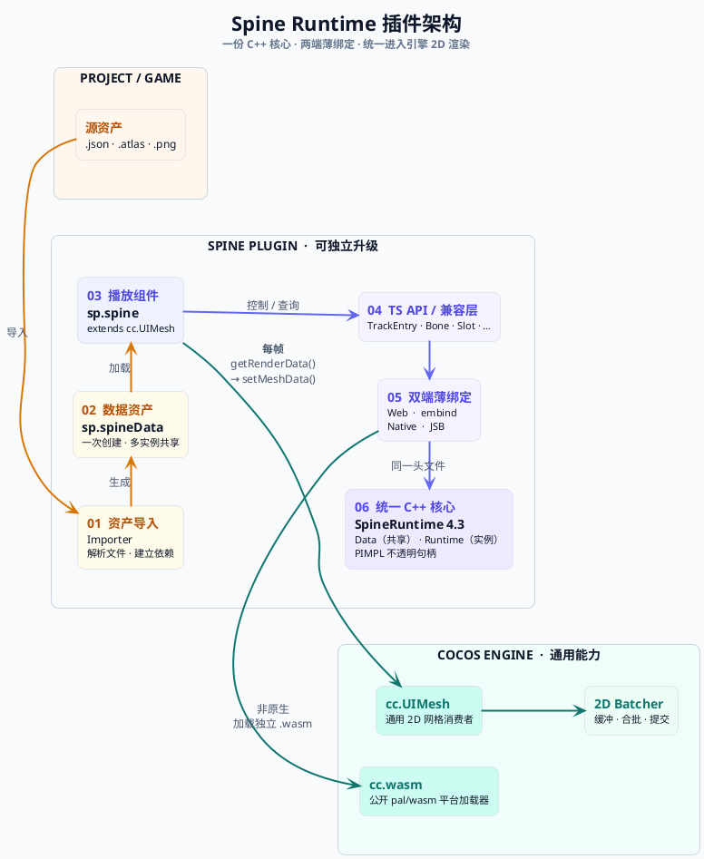
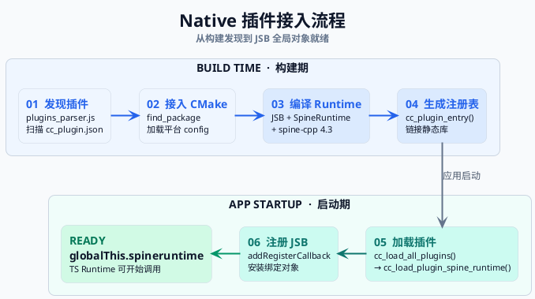

# sp.spine —— Spine 运行时重构方案（插件版）

> 状态：方案已落地。微信小游戏（WASM）、Windows Native Simulator（JSB）和 Android 模拟器（JSB）均已运行验证；iOS/macOS 已接入但尚未做设备验证。本文档说明方案架构，以及与当前引擎内置 Spine 相比的优缺点。

---

## 1. 背景：当前引擎内置 Spine 的问题

Cocos Creator 3.8 的 Spine 支持是**双栈双绑定**结构，历史包袱重：

| 层 | Web | Native |
|---|---|---|
| 骨骼运行时 | spine-wasm：`SpineSkeletonInstance`（默认 spine-cpp 3.8，可选 4.2） | `SkeletonAnimation` / `SkeletonCacheAnimation`（默认 spine-cpp 3.8，可选 4.2） |
| 绑定 | **embind** | **swig**（`jsb-spine-skeleton.js`） |
| 渲染 | TS assembler 生成网格 → 引擎 2D 合批 | C++ 自绘网格 + 素材合批 |
| 缓存 | TS `SkeletonCache`（REALTIME / SHARED_CACHE / PRIVATE_CACHE） | C++ 骨骼缓存系统（同三档） |
| 当前自定义引擎配置 | 3.8（4.2.80 源码可选） | 3.8（4.2.80 源码可选） |

由此带来的问题：

1. **2×2 行为漂移** —— Web / Native 各一套实现，同一动画在不同平台表现可能不同；TS 层还要再包一层。
2. **两套绑定要维护** —— embind 与 swig 语法、对象生命周期、事件桥完全不同，改一个接口要同步两处。
3. **引擎仓库耦合深** —— spine 代码散落在 `native/cocos/editor-support/spine`、`native/cocos/editor-support/spine-wasm`、`cocos/spine`（TS），删改牵扯面大。
4. **版本受引擎配置约束** —— 当前工程默认 3.8，即使切到内置 4.2.80，也不能独立于引擎版本快速升级。
5. **TS 直接摸官方类** —— `cocos/spine` 大量暴露 spine-ts 的结构，升级或替换 runtime 都会破坏 API。

---

## 2. 方案总览

**核心思路：用插件提供可与引擎内置版本共存的 Spine 4.3**。引擎侧只提供两个通用能力:`cc.UIMesh` 消费 2D 网格、`cc.wasm` 公开已有的平台 WASM loader;Spine 的计算、绑定和资源管线都收进插件。



### 分层

| 层 | 内容 | 位置 |
|---|---|---|
| C++ | `SpineRuntime`：以 `Data` / `Runtime` 不透明句柄和自由函数封装 spine-cpp **4.3** | 插件 `native/spine-adapter/` |
| 绑定 | **AOT Embind**（非原生，wasm）+ **JSB**（原生），共用同一份 C++ 头文件 | 插件 |
| TS 运行时 | `sp.spine` 组件、`sp.spineData` 资产、spine-ts 兼容包装类（`TrackEntry` / `Bone` / `Slot` / `Animation` / `Skin` / `Event`） | 插件 `runtime/` |
| 引擎通用能力 | `cc.UIMesh` 2D 网格消费者 + 公开 `cc.wasm`（转发 `pal/wasm`） | 引擎 `cocos/2d/components/ui-mesh.ts`、`exports/webassembly.ts` |
| 资产管线 | `asset-handler` importer：`.json` + `.atlas` + `.png` → `sp.spineData` | 插件 `editor/importer/` |
| WASM 分发 | 编辑器启动同步到 `native/external/`;发布构建复制到 `cocos-js/` | 插件 `main.js`、`editor/build/` |
| Native 接入 | native-extension 机制：`cc_plugin.json` + CMake + `CC_PLUGIN_ENTRY` | 插件 `native/` |

---

## 3. 架构细节

### 3.1 C++ 核心：SpineRuntime

在 spine-cpp 4.3 外增加一层轻量接口（`SpineRuntime`），将资源与播放实例的生命周期、动画更新和渲染数据输出收敛在插件内部。对外只保留两类概念：可共享的骨骼数据（`Data`），以及组件各自持有的播放实例（`Runtime`），两者以不透明句柄暴露给 TS 层。

非原生与原生分别通过 AOT Embind、JSB 接入同一套接口（共用一份 `SpineRuntime.h`），平台差异停留在薄绑定层。仅保留 realtime 模式，不引入缓存管线，原因见 §3.6。

### 3.2 TS 适配层

TS 层负责连接 Creator 组件体系与 C++ 核心，范围控制在三部分：

- **组件**：`sp.spine` 管理播放实例，并把每帧网格数据交给 `cc.UIMesh`。
- **资产**：`sp.spineData` 关联骨骼、atlas 与纹理资源，供多个组件复用。
- **兼容接口**：优先覆盖常用的 spine-ts 调用方式，降低旧项目的迁移成本。

这一层只做适配，不依赖引擎内部接口。兼容接口对齐官方 spine-ts 命名与语义（`TrackEntry` / `Bone` / `Slot` / `Animation` / `Skin` / `Event` 等包装类），完整 API 见 README「API 速查」。

### 3.3 引擎侧通用能力：cc.UIMesh + cc.wasm

```ts
// cocos/2d/components/ui-mesh.ts  （新增，导出到 'cc'）
export interface UIMeshSegment { indexOffset; indexCount; texture; material; }
export interface UIMeshData {
    vertexCount; vertexStride; vertexData: Uint8Array;
    indexCount;  indexData: Uint8Array;
    segments: UIMeshSegment[];
}
export class UIMesh extends UIRenderer {
    public setMeshData (data: UIMeshData): void;
}
```

- 组件（数据提供方）只填 `setMeshData`；缓冲分配、合批、提交全部由引擎内部完成。
- **通用性**：它是「2D 网格数据消费者」，不感知 spine —— dragonbones、自定义骨骼、程序化网格都能复用。
- **对现有引擎零影响**：纯新增类，不修改任何现有渲染路径。
- Spine 每帧先调用 `runtimeSetOutputTransform`，让 C++ 把节点世界变换与 y 翻转烘焙进顶点；组件必须调用 `super.onLoad()` 初始化 UIMesh 渲染实体，并强制 `setUseLocal(false)`，避免矩阵重复应用。

外置 wasm 通过自定义引擎公开的 `cc.wasm.instantiateWasm` 加载。它只是把引擎已有的 `pal/wasm` 平台适配器导出给插件使用:Web 获取二进制,小游戏把 `cocos-js/<name>.wasm` 文件路径交给平台 API。这样编辑器预览、Web 和微信小游戏共用同一 loader,无需内嵌 base64 或维护微信专用 glue。

### 3.4 资产管线：asset-handler（3.8.3+ 官方机制）

- `package.json` `contributions["asset-db"]["asset-handler"]` 注册 `spine-skeleton` handler。
- `.json` 导入时：读取 JSON → 同目录找 `.atlas` → 解析贴图页 → 输出 `sp.spineData` 序列化负载 + 建立依赖（`depend()` / `setData('depends')`）。`.skel` 导入时：原始字节经 `copyToLibrary('.bin', ...)` 存为 native sidecar 文件，序列化负载的 `_native` 指向它，引擎加载时经 `SpineData._nativeAsset` 回填。
- 用户在编辑器里选中 `.json` 即得 `sp.spineData` 资产，拖到组件的 `spineData` 属性即可（`setSkeletonData` 仅为旧版别名）。

### 3.5 Native 接入：native-extension（无需改引擎）

- `native/cc_plugin.json` 声明插件模块（target：`spine_runtime`）+ 各平台 `spine_runtime-config.cmake` 供 `find_package`。
- `CC_PLUGIN_ENTRY(name, load_func)` 生成 `cc_load_plugin_spine_runtime()`，插件通过 `se::ScriptEngine::addRegisterCallback` 注册 JSB 绑定（回调签名 `bool(*)(se::Object*)`）。
- 平台：Android / iOS / macOS / Windows，一套 C++ + 一套 JSB 桥。
- Native 环境严格要求 `globalThis.spineruntime`;绑定缺失时直接失败,不会回退 wasm。
- stock Native Simulator 不扫描工程扩展。`native/spine_runtime_simulator.cmake` 用 `CMAKE_PROJECT_INCLUDE` 把同一静态库和插件注册表显式链接进 Simulator,并注入 `cc_load_all_plugins()`。



### 3.6 缓存模式：不再支持

新版仅保留 `REALTIME`，移除旧版 `SHARED_CACHE` / `PRIVATE_CACHE` 两档缓存。依据是压测数据与维护成本。

**realtime 开销可控**（1 核 1G 受限配置基准环境，100 骨架/帧；这里的“模拟”不是 Creator Native Simulator）：

| 模型 | 100 骨架/帧 | 占 60fps 预算 |
|---|---|---|
| spineboy（67 骨骼 / 52 槽位） | 1.10 ms | 6.5% |
| raptor（76 骨骼） | 2.26 ms | 13.5% |
| dragon（33 骨骼） | 0.65 ms | 3.9% |

> 用例为官方完整版示例骨架，含网格变形、IK、路径约束等特性，复杂度与游戏内常见角色相当。realtime 在「大量 + 复杂骨架」场景下的 CPU 开销，在当前设备量级上是可控的。

**cache 模式本身的代价**：

- cache 相关代码约 **2400 行**，且分 web（TS）与 native（C++）两套实现；
- 历史上约 **85 个提交**在修 cache 相关 bug（内存、越界、缓存失效、事件等）；
- 两套实现在行为上存在不一致（如补烘、预烘接口）。

**决策**：只保留 realtime 后，平台/模式组合从 4 种减少到 2 种，一致性风险相应变小。老项目保留序列化兼容——遇到 cache 配置时**回退到 realtime**（`setAnimationCacheMode` 对非 REALTIME 给出提示），现有项目不会因此崩溃。

---

## 4. 相比当前引擎版本的优点

### 4.1 消灭双端行为漂移
旧版 Web/Native 两套实现，同一动画两套行为。新版 **一份 C++ 实现**（spine-cpp 4.3），非原生（wasm）与原生（JSB）只差绑定和渲染缓冲读取方式，核心动画行为一致。

### 4.2 绑定从两套变一套
embind + swig 语义完全不同的两套业务对象绑定 → 统一为「一份 `SpineRuntime.h` + 两套薄绑定」；接口收敛为不透明句柄与自由函数,核心语义只实现一次,两端同步暴露。

### 4.3 插件的 Spine 4.3 维护面与引擎解耦
引擎内置 Spine 继续保留,插件的 spine-cpp 4.3 与适配代码全部在本仓库。升级插件运行时不需要修改引擎内置 Spine 模块,两套版本通过 `spine43::` 命名空间隔离后可并存。

### 4.4 引擎改动最小且通用
引擎侧增加两项通用能力:`cc.UIMesh`（通用 2D 网格消费者）和公开的 `cc.wasm`（转发已有 `pal/wasm`）。前者可复用到其他 2D 网格需求,后者可供其他扩展跨 Web/小游戏加载独立 wasm;两者都不是 Spine 专用逻辑。

### 4.5 版本升级：spine-cpp 4.3
- 支持 spine 4.3 新格式与特性，跟上官方能力。
- C++ 解析器 JSON 与二进制走同一条 4.3 解析管线（旧版 JSON/二进制分家）；绑定层对称提供 `createDataJson`/`createDataBinary`（wasm 端用 `vecFromJSArray` 拷贝、JSB 端用 `getTypedArrayData` 零拷贝），导入器和运行时都已接通两种格式。
- 88 个 4.3 源文件统一编译，源码补丁面小。

### 4.6 渲染收敛到引擎 2D 合批
旧版 Native 走 C++ 自绘网格 + 自己的合批，与引擎 2D 渲染路径不一致。新版双端都走 `setMeshData → cc.UIMesh → 引擎 2D batcher`，**统一享受引擎的合批与提交优化**。

### 4.7 渐进式迁移，用户无需一次性重写
- 新组件命名 `sp.spine`，与旧 `sp.Skeleton` 并存。
- 数据资产 `sp.spineData` 与旧 `sp.SkeletonData` 并存。
- 用户可逐个场景/组件替换，逐步迁移，不阻塞现有项目。
- 组件提供 `loadFromJson(...)` 便捷入口，测试/原型可纯代码驱动。

### 4.8 API 兼容 spine-ts，迁移成本低
`TrackEntry` / `Bone` / `Slot` / `Animation` / `Skin` / `Event` 等包装类对齐官方 spine-ts 命名与语义，持有句柄但用法和原来一致，用户代码改动最小。

### 4.9 架构上为后续留了口子
- **可插拔替换**：SpineRuntime 是插件模块，未来官方 runtime 更新只需插件内升级 C++，不影响引擎。
- **可测试**：C++ 层有独立 POC（`native/spine-adapter/poc/`），脱离引擎单测核心逻辑。
- **可扩展**：`cc.UIMesh` 是通用消费者，新的 2D 网格方案（Mesh 动画、程序化网格）可直接挂接。

---

## 5. 风险与注意

| 风险 | 说明 | 对策 |
|---|---|---|
| 测试资产许可证 | 官方 spine 样例数据有许可证限制，不能直接发布 | POC/测试用自写数据；已在测试工程嵌入自写 JSON+atlas |
| `cc.UIMesh` 随引擎版本 | 引擎后续版本若改动 2D 渲染内部，`ui-mesh.ts` 需跟进 | `ui-mesh.ts` 用引擎公开/受控 API，改动面小 |
| `cc.wasm` 非 stock 公共 API | 插件当前依赖自定义引擎的 `exports/webassembly.ts` | 安装前检查 `cc.wasm.instantiateWasm`;后续若上游提供正式扩展 API再迁移 |
| 外置 wasm 漏拷或版本错配 | glue 与 `.wasm` 不同构建会导致 Embind 注册/调用异常 | 同步更新 `prebuilt` 两个文件;`main.js` 与 builder hook 分别覆盖预览和发布产物 |
| 小游戏 WASM 兼容 | 沙箱禁止动态代码执行,微信校验器对新 WASM 特性支持滞后 | `EMBIND_AOT=1` + `DYNAMIC_EXECUTION=0`,并关闭 reference-types/bulk-memory |
| 顶点格式对齐 | 单色/双色顶点格式必须与引擎 2D vertex format 一致 | 固定 `V3F_T2F_C4B`(24B) / `V3F_T2F_C4B_C4B`(28B) 两档 |
| 原生插件符号冲突 | spine-cpp 4.3（vendored）与引擎内置 spine（3.8 默认开）同用 `spine::` 命名空间 | 已用 `COMPILE_DEFINITIONS "spine=spine43"` 隔离，Android 产物 `llvm-nm` 验证无重复符号 |
| Native Simulator 不扫描扩展 | stock Simulator 不会生成/调用工程插件注册表 | 用 `native/spine_runtime_simulator.cmake` 重建;运行时禁止回退 wasm |
| 编辑器拖拽 | 3.8 编辑器 `createNodeByAsset` 是硬编码 switch，自定义资产拖入场景默认走 `cc.instantiate` | 已实现 drop-handle（`editor/scene/drop-handle.js`）接管场景/层级拖拽 |

---

## 6. 结论

大方向：**以插件形式补充 Spine 4.3,用单一 C++ 门面统一 WASM/JSB 后端,渲染交给 `cc.UIMesh`,非原生二进制交给 `cc.wasm` 加载;引擎内置 Spine 可继续共存。**

换来的是：核心行为统一、绑定与维护面收敛、渲染统一走引擎合批、插件版本可独立跟进、用户可渐进迁移。代价是：依赖带 `cc.UIMesh`/`cc.wasm` 的自定义引擎,需要维护 wasm 文件分发钩子,并为 stock Native Simulator 单独构建 JSB 插件。
